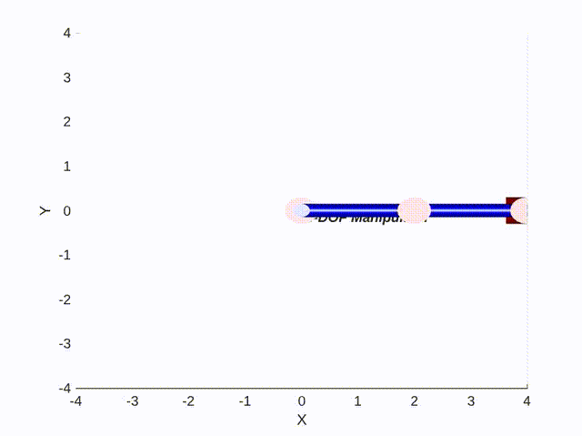
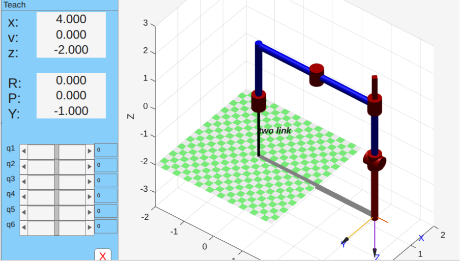
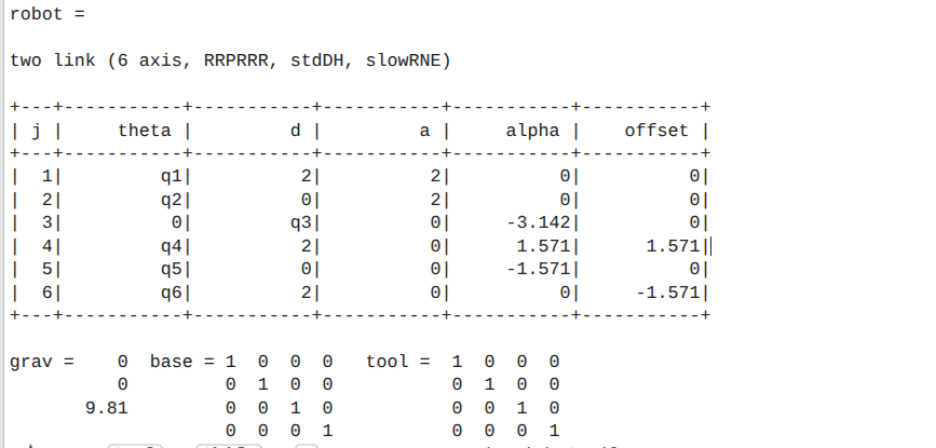
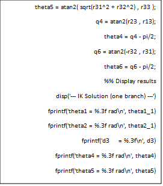
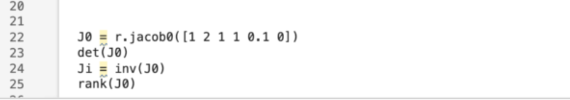

# 🦾 Kinematic Control of a 3-DOF Robotic Manipulator
### Mathematical Modeling & Motion Planning

## 📝 Overview
This project moves beyond simple motor rotation by implementing **coordinate-based control** for a 3-DOF robotic arm. Using custom mathematical models, the system allows the user to input $(X, Y, Z)$ coordinates, and the robot automatically calculates the required joint angles to reach that position in 3D space.

### 🎥 Live Simulations
| Demo 1: Forward Kinematics | Demo 2: Inverse Kinematics |
| :---: | :---: |
|  |  |
> *Click the images above to watch the demos on YouTube.*

## 🧠 Key Implementations

### 1. The Challenge
Controlling a robot arm is difficult because motors move in circles (rotational motion), but we often want the hand to move in straight lines (linear motion) to grab objects.

### 2. The Solution
I implemented the fundamental geometric algorithms required for spatial navigation:

| Feature | Description |
| :--- | :--- |
| **Forward Kinematics (FK)** | Calculates the Cartesian position $(X, Y, Z)$ of the end-effector based on current joint angles $(\theta_1, \theta_2, \theta_3)$. |
| **Inverse Kinematics (IK)** | The reverse process: Calculates the required joint angles to reach a specific target coordinate $(X, Y)$. This allows for "Point-and-Click" control. |
| **Trajectory Planning** | Interpolates intermediate points to drive the end-effector in straight lines rather than natural arcs. |

## 💻 Tech Stack
* **Simulation:** MATLAB (Visualizing the DH-Parameters and workspace).
* **Hardware Control:** C++ / Arduino.
* **Actuators:** Dynamixel AX-12 Servos.

## 📊 Visual Results
**MATLAB Visualization & Verification:**
|  |  |
*The figure above shows the calculated link positions required to reach the target coordinate $(4, 0, -2)$, verifying the IK solver before hardware deployment.*

## 📂 File Structure
* `ik_matlab.m`: MATLAB script for calculating Inverse Kinematics.
* `forward_kinematics.ino`: C++ code for FK implementation on the microcontroller.
* `jacobian.m`: Differential kinematics for velocity control.

## 📸 Project Gallery
Detailed views of the MATLAB simulation, trajectory planning, and hardware implementation.

| | | |
|:---:|:---:|:---:|
|  |  |  |
|  |  |  |
|  |  |  |
---
*Created by [Abdullakim](https://github.com/Abdullakim1)*
